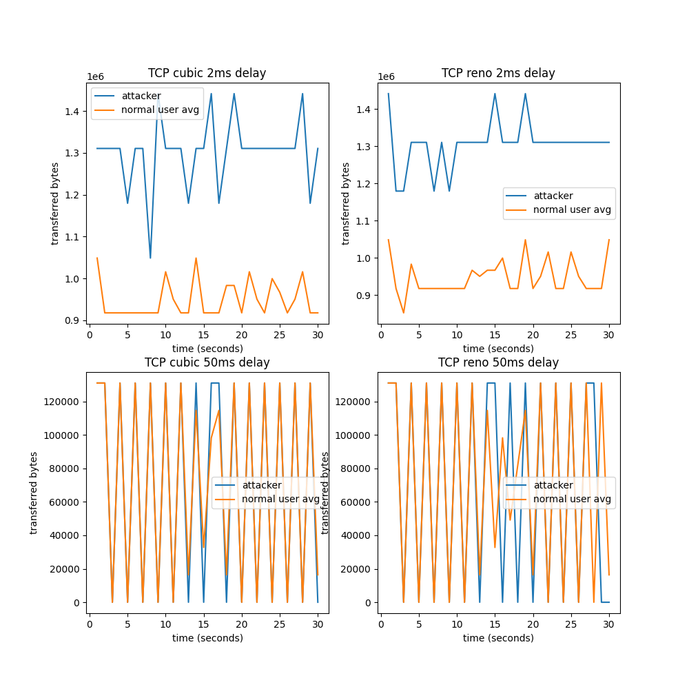
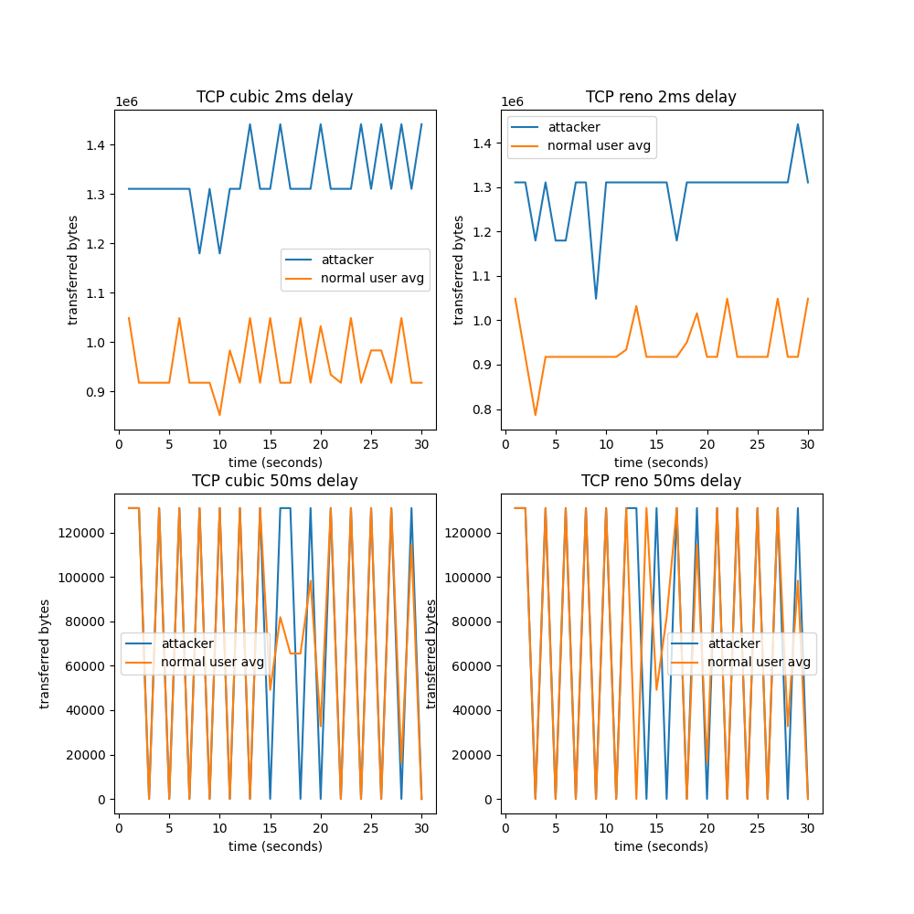
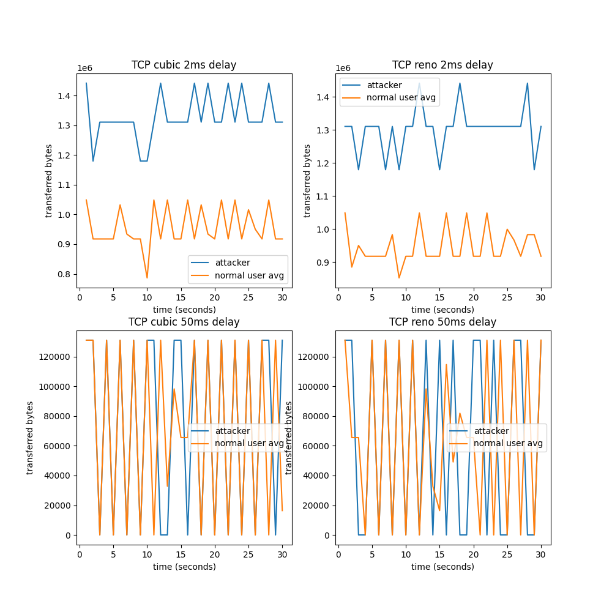
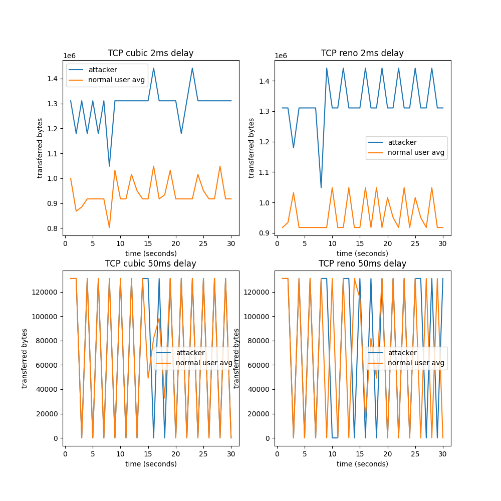
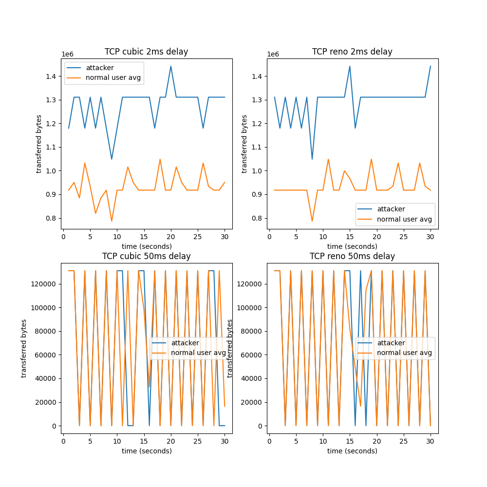
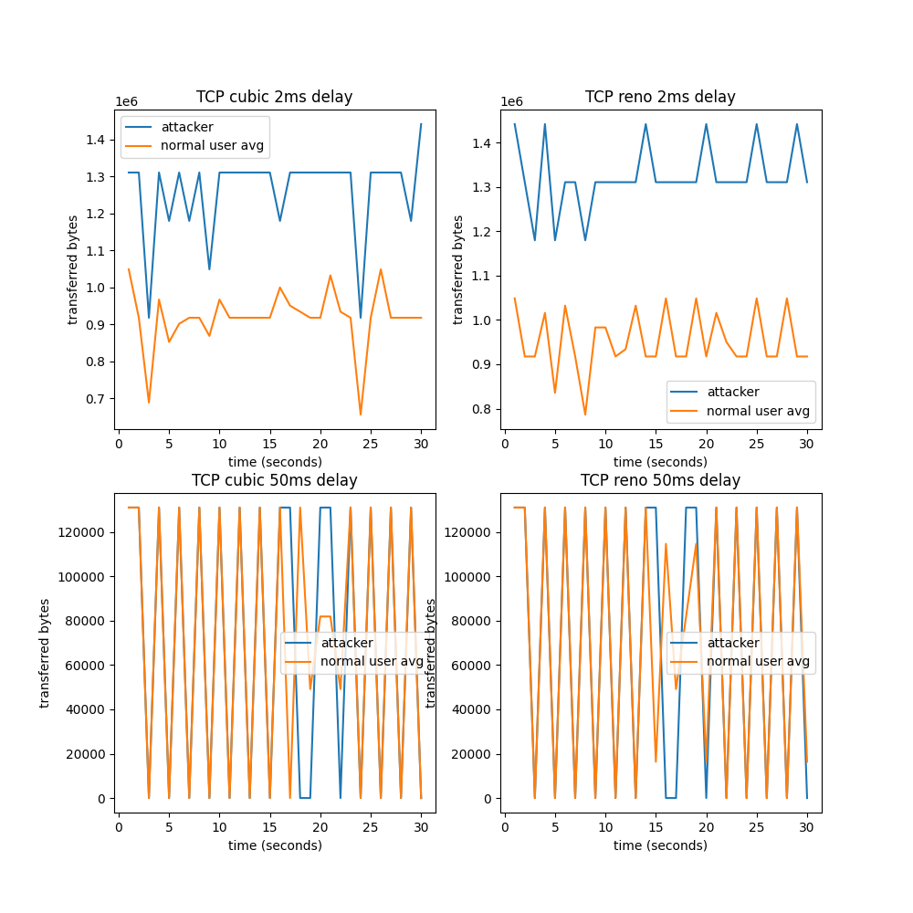
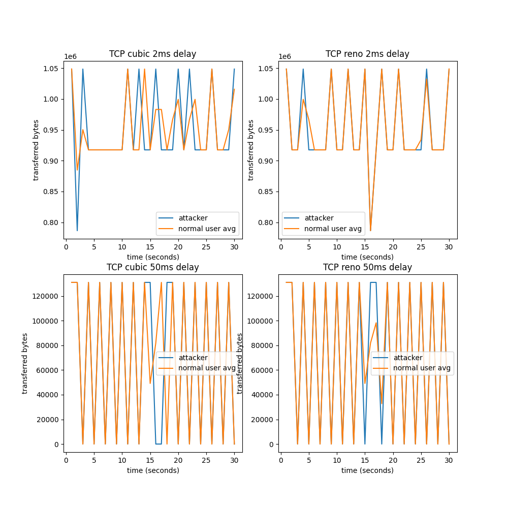

# Graphs

### 500-200-10-200-NoMix-32K-32K

### 500-200-10-100-NoMix-32K-32K

### 500-200-10-400-NoMix-32K-32K

### 500-200-10-800-NoMix-32K-32K

### 500-200-10-1000-NoMix-32K-32K

### 500-200-10-50-NoMix-32K-32K

### 500-200-10-10-NoMix-32K-32K

