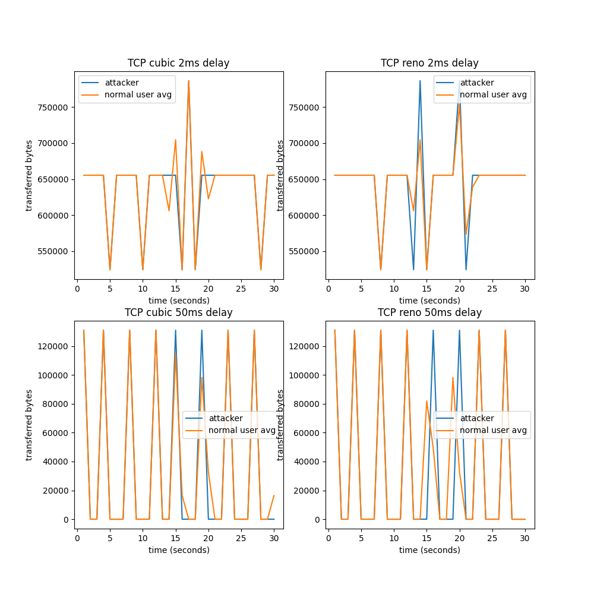
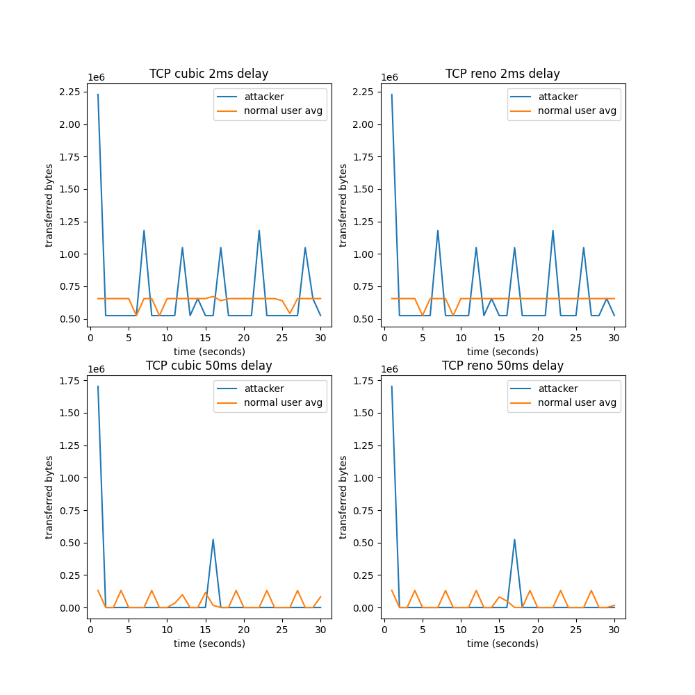
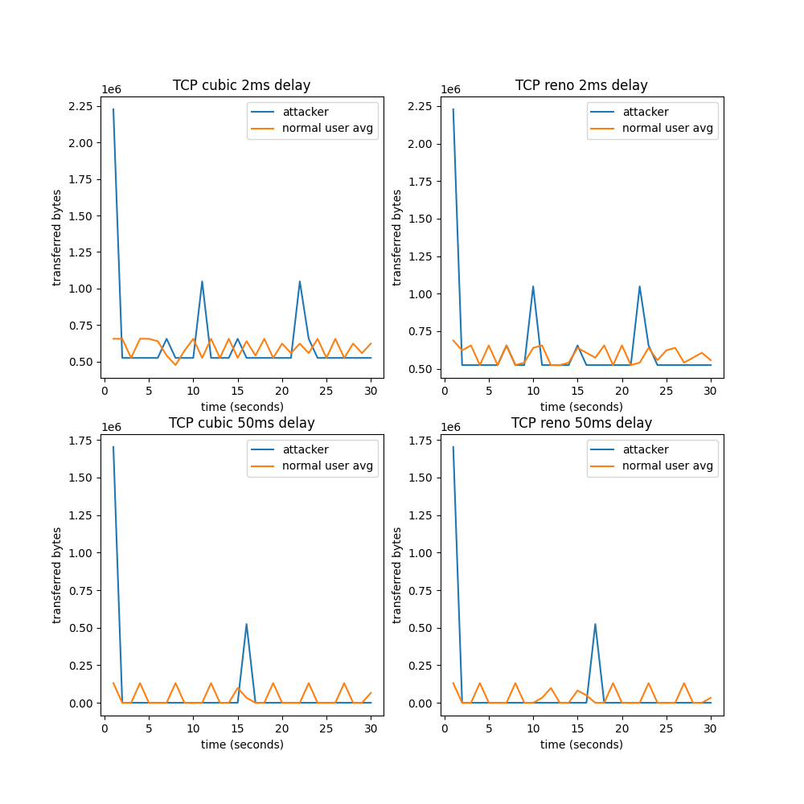
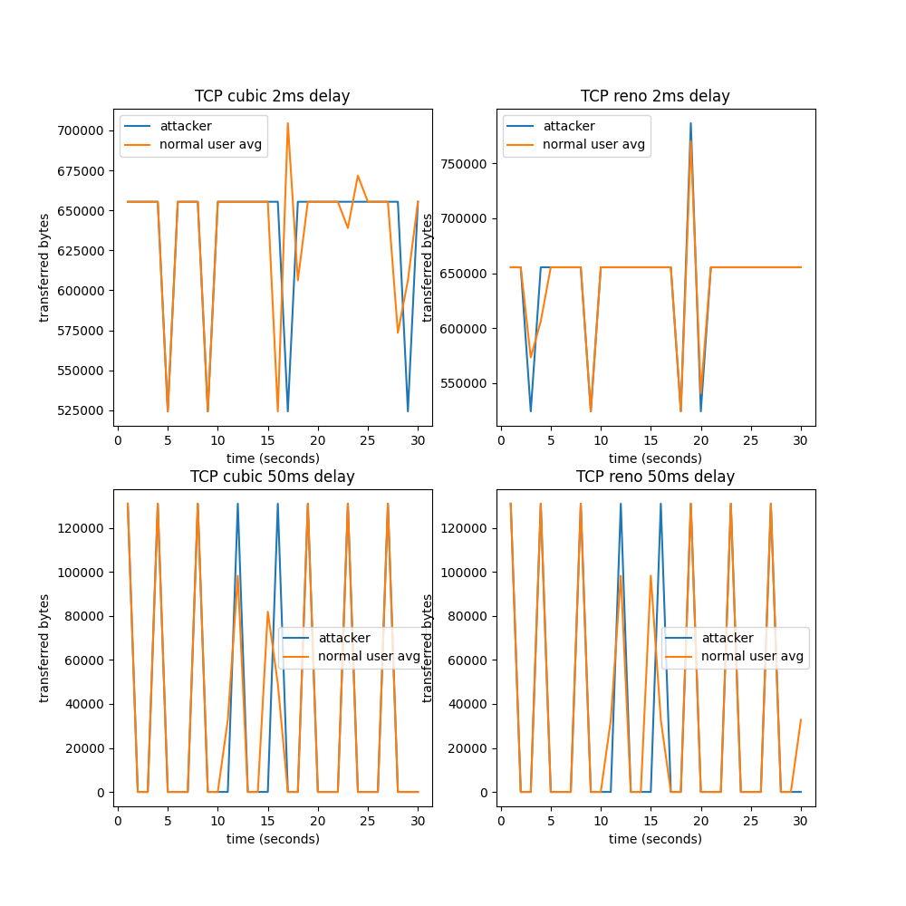
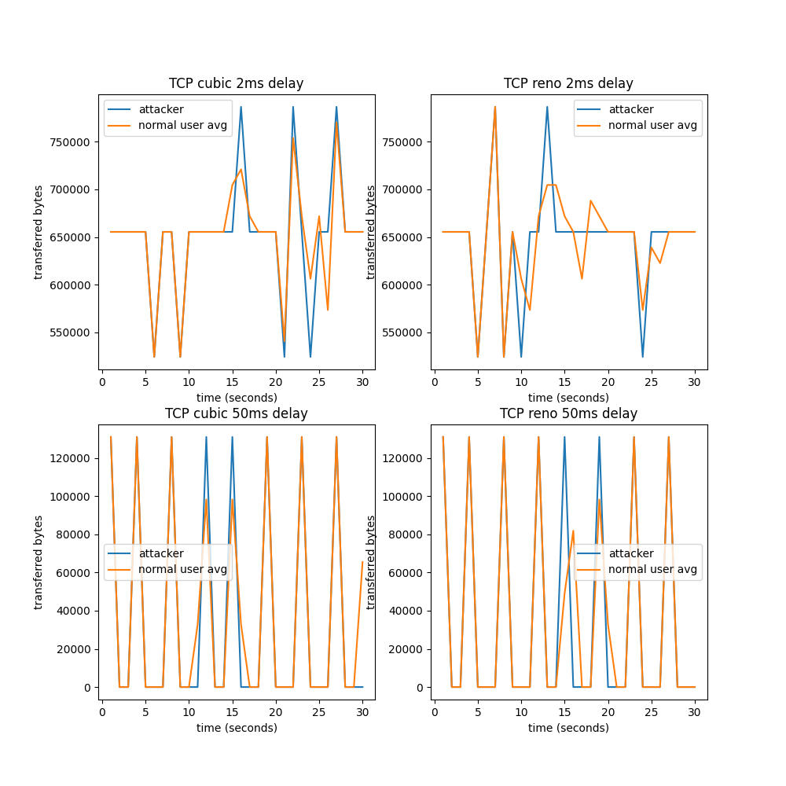
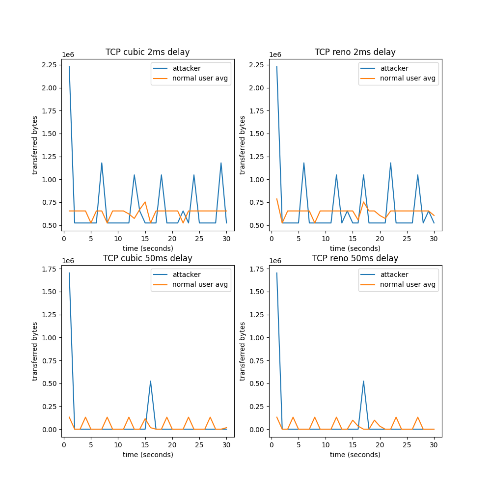
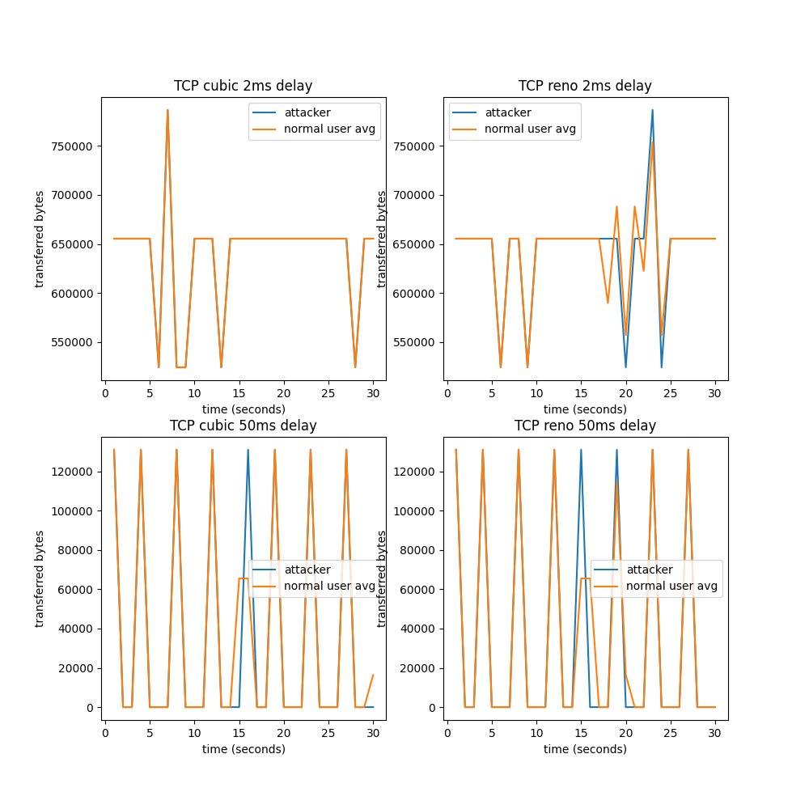
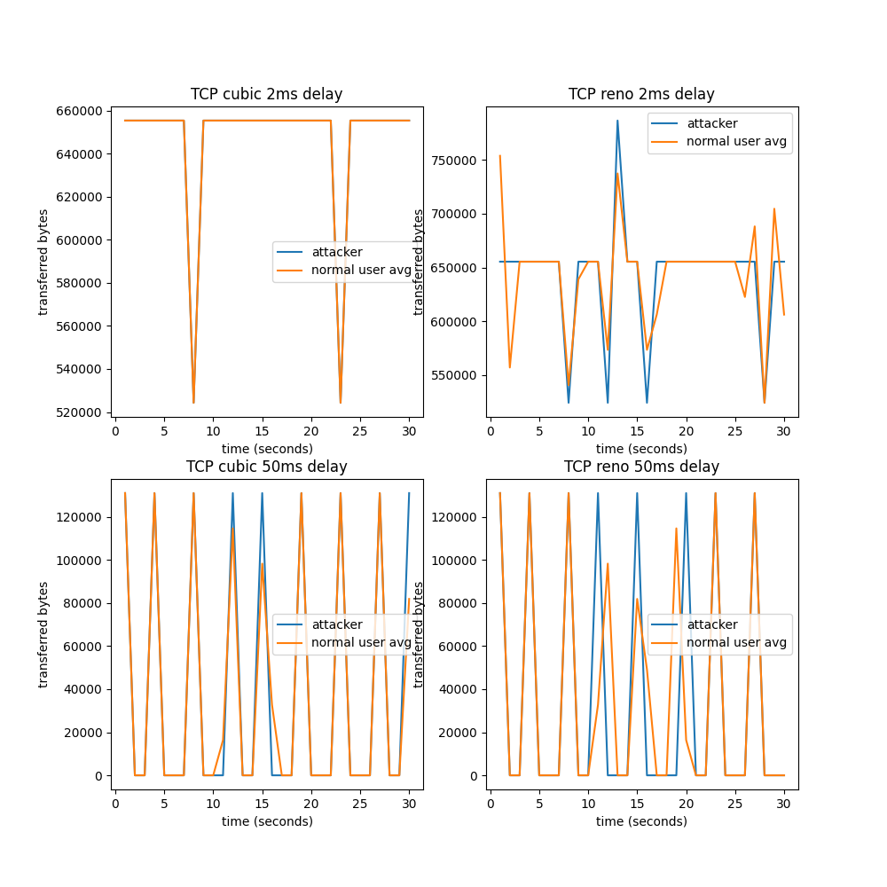
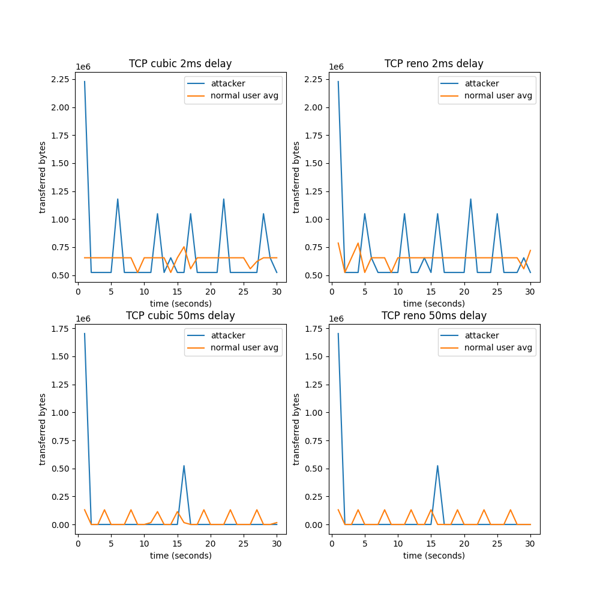
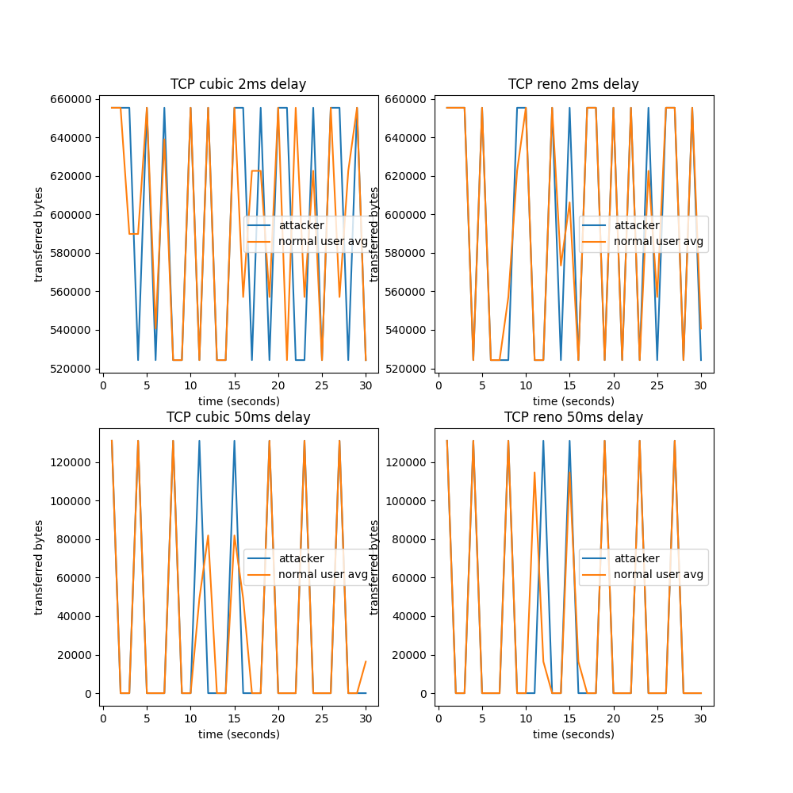

# Graphs

### 500-100-10-10-Mix-16K-1M

### 500-500-10-50-Mix-16K-16K

### 500-500-10-20-NoMix-16K-1M

### 500-100-10-200-Mix-16K-1M

### 500-100-10-50-NoMix-16K-1M

### 500-500-10-10-Mix-16K-1M

### 500-500-10-10-Mix-16K-16K

### 500-500-10-200-NoMix-16K-1M

### 500-100-10-10-NoMix-16K-16K

### 500-100-10-10-NoMix-16K-1M

### 500-500-10-20-Mix-16K-16K

### 500-100-10-800-NoMix-16K-16K

### 500-500-10-800-NoMix-16K-1M

### 500-100-10-50-Mix-16K-1M

### 500-100-10-800-Mix-16K-1M

### 500-500-10-10-NoMix-16K-1M

### 500-100-10-20-NoMix-16K-16K

### 500-500-10-10-NoMix-16K-16K

### 500-100-10-20-Mix-16K-16K

### 500-100-10-20-Mix-16K-1M

### 500-100-10-20-NoMix-16K-1M

### 500-500-10-200-NoMix-16K-16K

### 500-100-10-50-NoMix-16K-16K

### 500-100-10-50-Mix-16K-16K

### 500-100-10-800-Mix-16K-16K

### 500-100-10-200-Mix-16K-16K

### 500-500-10-800-NoMix-16K-16K

### 500-500-10-50-NoMix-16K-1M

### 500-500-10-50-Mix-16K-1M

### 500-500-10-20-NoMix-16K-16K

### 500-100-10-800-NoMix-16K-1M

### 500-500-10-50-NoMix-16K-16K

### 500-500-10-200-Mix-16K-16K

### 500-500-10-800-Mix-16K-1M

### 500-100-10-200-NoMix-16K-1M

### 500-500-10-20-Mix-16K-1M

### 500-100-10-200-NoMix-16K-16K

### 500-500-10-800-Mix-16K-16K

### 500-500-10-200-Mix-16K-1M

### 500-100-10-10-Mix-16K-16K

